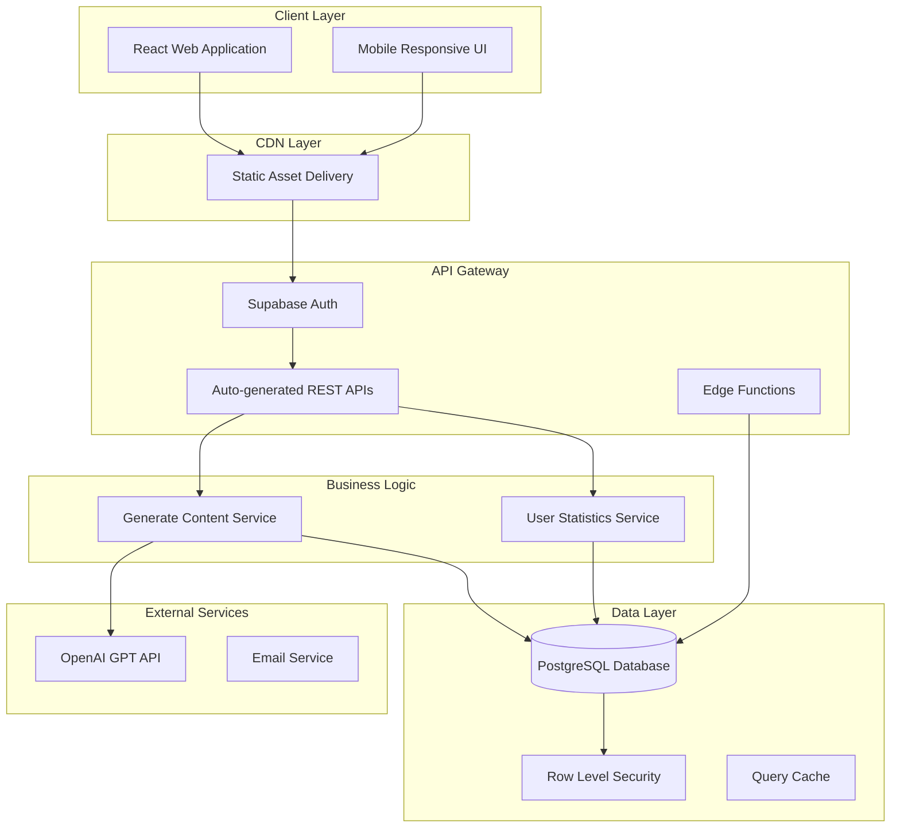
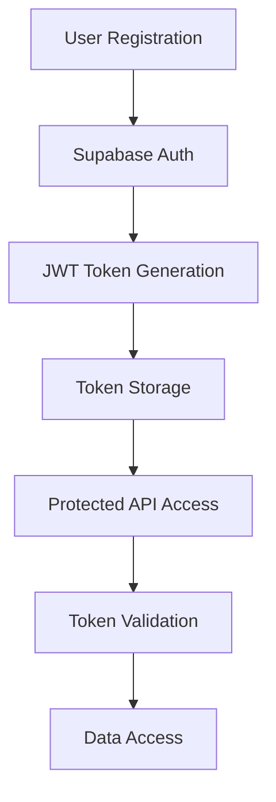
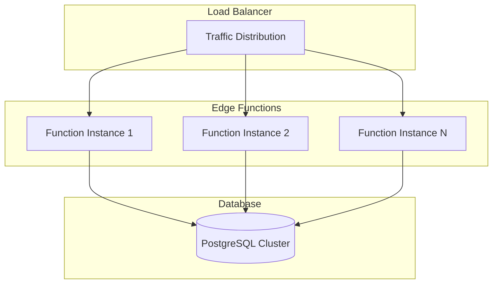

# AI Content Creator - Project Architecture Document

**Version**: 1.0  
**Date**: October 27, 2025  
**Author**: MiniMax Agent  
**Status**: Production Ready  

---

## Table of Contents

1. [Executive Summary](#1-executive-summary)
2. [System Architecture Overview](#2-system-architecture-overview)
3. [File Hierarchy & Code Organization](#3-file-hierarchy--code-organization)
4. [Application Architecture](#4-application-architecture)
5. [Database Design & Security](#5-database-design--security)
6. [Technology Stack](#6-technology-stack)
7. [API Documentation](#7-api-documentation)
8. [Deployment Architecture](#8-deployment-architecture)
9. [Security Architecture](#9-security-architecture)
10. [Performance & Scalability](#10-performance--scalability)
11. [Monitoring & Maintenance](#11-monitoring--maintenance)
12. [Development Workflow](#12-development-workflow)
13. [Future Enhancements](#13-future-enhancements)

---

## Visual Architecture Diagrams

This document includes comprehensive visual diagrams that illustrate the system architecture and user flows:

- **User Journey Flow**: `diagrams/user-journey-diagram.png` - Complete user experience from registration to content generation
- **Application Logic Flow**: `diagrams/application-logic-flow.png` - Internal content generation process and API interactions
- **System Architecture**: `diagrams/system-architecture.png` - High-level component interactions and data flow
- **Database Schema**: `diagrams/database-schema.png` - Entity relationships and database structure

**Diagram Guide**: See `DIAGRAMS_GUIDE.md` for detailed explanations of each diagram and their usage.

---

## 1. Executive Summary

### 1.1 Project Overview

The AI Content Creator is a full-stack web application designed to empower small business owners with AI-driven marketing content generation. The application provides a user-friendly platform for creating social media posts and advertising copy through intelligent automation, significantly reducing the time and expertise required for content creation.

**Key Business Value:**
- **Time Efficiency**: Reduces content creation time from hours to minutes
- **Cost Effectiveness**: Eliminates need for expensive marketing agencies
- **Consistency**: Ensures brand voice consistency across all content
- **Accessibility**: Makes professional content creation available to non-marketers

### 1.2 Target Audience

**Primary Users:**
- Small business owners (25-50 years old)
- Freelancers and solopreneurs
- Marketing professionals seeking AI assistance
- Early adopters interested in AI tools

**User Characteristics:**
- Moderate to high tech-savviness
- Limited marketing expertise
- Time-constrained
- Budget-conscious
- Quality-focused

### 1.3 Technical Architecture Summary

The application follows a modern three-tier architecture with a focus on scalability, security, and user experience:

- **Frontend Tier**: React 18 + TypeScript single-page application
- **Backend Tier**: Serverless Supabase Edge Functions
- **Data Tier**: PostgreSQL database with Row Level Security
- **AI Integration**: OpenAI GPT-3.5-turbo for content generation
- **Authentication**: JWT-based Supabase Auth system

### 1.4 Key Design Decisions

**Technology Choices:**
- **React for Frontend**: Rapid development, rich ecosystem, strong community
- **Supabase for Backend**: Integrated auth, database, and serverless functions
- **PostgreSQL**: Robust, scalable, ACID-compliant database
- **OpenAI Integration**: Industry-leading language model for content generation
- **Serverless Architecture**: Automatic scaling, cost optimization, reduced maintenance

**Architecture Patterns:**
- **API-First Design**: Clean separation between frontend and backend
- **Stateless Authentication**: JWT tokens for session management
- **Row Level Security**: Database-level access control
- **Component-Based Frontend**: Reusable, maintainable React components
- **Edge Computing**: Reduced latency through distributed execution

---

## 2. System Architecture Overview

### 2.1 High-Level Architecture

The AI Content Creator employs a modern client-server architecture with serverless backend services:


*Figure: Complete system architecture showing client applications, CDN, API gateway, business logic, and data layers with external service integrations.*



### 2.2 Architectural Principles

**Scalability:**
- **Horizontal Scaling**: Serverless functions scale automatically
- **Database Optimization**: Proper indexing and query optimization
- **Caching Strategy**: In-memory caching for frequently accessed data
- **CDN Integration**: Static asset delivery through global CDN

**Security:**
- **Zero Trust Architecture**: All requests authenticated and authorized
- **Defense in Depth**: Multiple security layers (RLS, JWT, CORS)
- **Data Encryption**: TLS for transit, encryption at rest
- **Input Validation**: Comprehensive validation at all entry points

**Reliability:**
- **Graceful Degradation**: System continues to function with partial failures
- **Error Handling**: Comprehensive error handling and user feedback
- **Health Monitoring**: System health checks and monitoring
- **Backup Strategy**: Automated database backups

**Maintainability:**
- **Modular Architecture**: Clear separation of concerns
- **Type Safety**: TypeScript for compile-time error detection
- **Code Organization**: Consistent file structure and naming conventions
- **Documentation**: Comprehensive technical documentation

### 2.3 Service Architecture

**Authentication Service:**
- JWT token-based authentication
- User registration and login
- Session management
- Password security with bcrypt hashing

**Content Generation Service:**
- OpenAI GPT-3.5-turbo integration
- Prompt engineering for content optimization
- Content type differentiation (social media vs. ads)
- Brand voice customization

**Data Management Service:**
- User profile management
- Content storage and retrieval
- Analytics data collection
- Feedback management

**User Interface Service:**
- React-based SPA
- Responsive design
- Real-time updates
- Component reusability

---

## 3. File Hierarchy & Code Organization

### 3.1 Root Directory Structure

```
ai-content-creator/
├── README.md                          # Project overview and quick start
├── START_HERE.md                      # Getting started guide
├── QUICK_START.md                     # Quick setup instructions
├── DEPLOYMENT.md                      # Deployment guide
├── TESTING_PLAN.md                    # Comprehensive testing guide
├── PROJECT_DELIVERY.md                # Project completion summary
├── .env.example                       # Environment variables template
├── .gitignore                         # Git ignore patterns
├── setup-backend.sh                   # Automated backend setup script
├── ai-content-creator-frontend/       # React frontend application
└── supabase/                          # Backend configuration
    ├── functions/                     # Edge Functions
    │   ├── generate-content/          # AI content generation service
    │   └── get-user-stats/            # User statistics service
    └── rls_policies.sql               # Database security policies
```

### 3.2 Frontend Architecture

**Directory Structure:**
```
ai-content-creator-frontend/
├── public/                            # Static assets
│   └── use.txt                        # Usage instructions
├── src/                               # Source code
│   ├── components/                    # Reusable UI components
│   │   ├── auth/
│   │   │   └── ProtectedRoute.tsx     # Route protection component
│   │   ├── layout/
│   │   │   └── Navbar.tsx             # Navigation component
│   │   └── ErrorBoundary.tsx          # Error handling wrapper
│   ├── contexts/                      # React contexts
│   │   └── AuthContext.tsx            # Authentication state management
│   ├── hooks/                         # Custom React hooks
│   │   └── use-mobile.tsx             # Mobile detection hook
│   ├── lib/                           # Utility libraries
│   │   ├── constants.ts               # Application constants
│   │   ├── supabase.ts               # Supabase client configuration
│   │   └── utils.ts                   # Utility functions
│   ├── pages/                         # Page components
│   │   ├── auth/
│   │   │   ├── LoginPage.tsx          # User login interface
│   │   │   └── RegisterPage.tsx       # User registration interface
│   │   ├── content/
│   │   │   └── GenerateContentPage.tsx # Content generation interface
│   │   ├── profile/
│   │   │   └── ProfileSetupPage.tsx   # Business profile setup
│   │   ├── DashboardPage.tsx          # User dashboard
│   │   └── HomePage.tsx               # Landing page
│   ├── types/                         # TypeScript type definitions
│   │   └── index.ts                   # Shared type definitions
│   ├── App.tsx                        # Main application component
│   ├── main.tsx                       # Application entry point
│   └── index.css                      # Global styles
├── package.json                       # Dependencies and scripts
├── vite.config.ts                     # Vite build configuration
├── tailwind.config.js                 # TailwindCSS configuration
├── tsconfig.json                      # TypeScript configuration
└── components.json                    # Shadcn/ui component configuration
```

### 3.3 Backend Architecture

**Edge Functions Structure:**
```
supabase/functions/
├── generate-content/                  # AI Content Generation Service
│   └── index.ts                       # Main function implementation
└── get-user-stats/                    # User Statistics Service
    └── index.ts                       # Main function implementation
```

**Database Schema:**
```
supabase/
├── rls_policies.sql                   # Row Level Security policies
└── migrations/                        # Database migrations (future)
```

### 3.4 Component Architecture Details

**React Component Hierarchy:**
```
App.tsx
├── BrowserRouter
├── AuthProvider
│   ├── Navbar
│   └── Routes
│       ├── HomePage
│       ├── LoginPage
│       ├── RegisterPage
│       ├── ProtectedRoute[DashboardPage]
│       │   └── Dashboard (protected)
│       ├── ProtectedRoute[ProfileSetupPage]
│       │   └── ProfileSetup (protected)
│       └── ProtectedRoute[GenerateContentPage]
│           └── GenerateContent (protected)
```

### 4.3 User Journey Flow

The complete user experience from first visit to content creation:


*Figure: Complete user journey showing registration, authentication, profile setup, content generation, and management workflows.*

**Context Providers:**
- **AuthContext**: Manages user authentication state
- Provides user data, login/logout functions
- Handles JWT token management
- Supplies authentication status throughout the app

**Custom Hooks:**
- **use-mobile**: Detects mobile device for responsive behavior
- **useAuth**: Authentication-related state management (extendable)
- **useContent**: Content generation and management (extendable)

### 3.5 Configuration Files

**Build Configuration:**
- **vite.config.ts**: Vite build tool configuration
- **tsconfig.json**: TypeScript compiler settings
- **tailwind.config.js**: TailwindCSS customization
- **postcss.config.js**: PostCSS plugins configuration

**Development Configuration:**
- **package.json**: Dependencies, scripts, and metadata
- **.env.example**: Environment variables template
- **eslint.config.js**: Code linting rules
- **.gitignore**: Version control exclusions

---

## 4. Application Architecture

### 4.1 Frontend Architecture

**React Application Structure:**

The frontend follows a modern React 18 architecture with TypeScript for type safety and TailwindCSS for styling.

**Component Design Patterns:**

1. **Container Components**: Page-level components that manage data fetching and business logic
2. **Presentational Components**: Pure UI components focused on rendering
3. **Custom Hooks**: Encapsulate reusable stateful logic
4. **Context Providers**: Share global state across components
5. **Protected Routes**: Guard routes requiring authentication

**State Management Strategy:**

```typescript
// Global State (Context API)
interface AuthContextType {
  user: User | null;
  loading: boolean;
  login: (email: string, password: string) => Promise<void>;
  register: (email: string, password: string) => Promise<void>;
  logout: () => void;
}

// Local State (useState)
const [content, setContent] = useState<GeneratedContent | null>(null);
const [loading, setLoading] = useState<boolean>(false);

// Derived State
const isAuthenticated = user !== null;
```

**Routing Architecture:**

```typescript
// Route Protection Strategy
<Route
  path="/dashboard"
  element={
    <ProtectedRoute>
      <DashboardPage />
    </ProtectedRoute>
  }
/>

// Conditional Rendering
{isAuthenticated ? <Dashboard /> : <LoginPrompt />}
```

### 4.2 Backend Architecture

**Supabase Edge Functions:**

The backend leverages Supabase Edge Functions for serverless compute, providing automatic scaling and reduced operational overhead.

**Function Architecture:**

```typescript
// Edge Function Structure
Deno.serve(async (req) => {
    // CORS Headers
    const corsHeaders = {
        'Access-Control-Allow-Origin': '*',
        'Access-Control-Allow-Headers': 'authorization, x-client-info, apikey, content-type',
        'Access-Control-Allow-Methods': 'POST, OPTIONS',
        'Access-Control-Max-Age': '86400',
        'Access-Control-Allow-Credentials': 'false'
    };
    
    if (req.method === 'OPTIONS') {
        return new Response(null, { status: 200, headers: corsHeaders });
    }
    
    try {
        // Business Logic
        const result = await processRequest(req);
        
        return new Response(JSON.stringify({ data: result }), {
            headers: { ...corsHeaders, 'Content-Type': 'application/json' }
        });
    } catch (error) {
        return handleError(error, corsHeaders);
    }
});
```

**API Design Patterns:**

1. **RESTful Endpoints**: Standard HTTP methods and status codes
2. **JSON Communication**: Consistent request/response formatting
3. **Error Handling**: Structured error responses with proper HTTP status codes
4. **CORS Configuration**: Proper cross-origin resource sharing setup
5. **Authentication**: JWT token validation and user verification

### 4.3 Data Flow Architecture

**Content Generation Flow:**

Detailed content generation logic including input validation, AI integration, caching, and error handling:


*Figure: Comprehensive content generation flow showing input validation, AI prompt engineering, OpenAI API integration, content processing, database storage, and error handling.*

**User Authentication Flow:**



### 4.4 Component Integration Patterns

**API Communication:**

```typescript
// Supabase Client Configuration
import { createClient } from '@supabase/supabase-js';

const supabaseUrl = import.meta.env.VITE_SUPABASE_URL;
const supabaseAnonKey = import.meta.env.VITE_SUPABASE_ANON_KEY;

export const supabase = createClient(supabaseUrl, supabaseAnonKey);

// API Service Layer
export const contentService = {
    async generateContent(data: ContentGenerationRequest): Promise<GeneratedContent> {
        const { data: result, error } = await supabase.functions.invoke('generate-content', {
            body: data
        });
        
        if (error) throw new Error(error.message);
        return result;
    }
};
```

**Error Handling Pattern:**

```typescript
// Global Error Boundary
class ErrorBoundary extends React.Component {
    constructor(props: any) {
        super(props);
        this.state = { hasError: false, error: null };
    }
    
    static getDerivedStateFromError(error: Error) {
        return { hasError: true, error };
    }
    
    componentDidCatch(error: Error, errorInfo: React.ErrorInfo) {
        console.error('Error caught by boundary:', error, errorInfo);
    }
    
    render() {
        if (this.state.hasError) {
            return <ErrorFallback error={this.state.error} />;
        }
        
        return this.props.children;
    }
}
```

---

## 5. Database Design & Security

### 5.1 Database Schema

The application uses PostgreSQL through Supabase with the following schema:

**Users Table (auth.users):**
- Managed by Supabase Auth
- Contains authentication data
- Automatically created during registration

**Profiles Table:**
```sql
CREATE TABLE profiles (
    id UUID DEFAULT gen_random_uuid() PRIMARY KEY,
    user_id UUID REFERENCES auth.users(id) ON DELETE CASCADE,
    industry VARCHAR(255) NOT NULL,
    brand_voice VARCHAR(255) NOT NULL,
    target_audience TEXT NOT NULL,
    created_at TIMESTAMP WITH TIME ZONE DEFAULT timezone('utc'::text, now()) NOT NULL,
    updated_at TIMESTAMP WITH TIME ZONE DEFAULT timezone('utc'::text, now()) NOT NULL
);
```

**Contents Table:**
```sql
CREATE TABLE contents (
    id UUID DEFAULT gen_random_uuid() PRIMARY KEY,
    user_id UUID REFERENCES auth.users(id) ON DELETE CASCADE,
    content_type VARCHAR(50) NOT NULL CHECK (content_type IN ('social_post', 'ad_copy')),
    platform VARCHAR(50) NOT NULL DEFAULT 'general',
    original_text TEXT NOT NULL,
    edited_text TEXT NOT NULL,
    topic VARCHAR(500) NOT NULL,
    tone VARCHAR(50) NOT NULL DEFAULT 'neutral',
    created_at TIMESTAMP WITH TIME ZONE DEFAULT timezone('utc'::text, now()) NOT NULL,
    updated_at TIMESTAMP WITH TIME ZONE DEFAULT timezone('utc'::text, now()) NOT NULL
);
```

**Feedback Table:**
```sql
CREATE TABLE feedback (
    id UUID DEFAULT gen_random_uuid() PRIMARY KEY,
    user_id UUID REFERENCES auth.users(id) ON DELETE CASCADE,
    rating INTEGER CHECK (rating >= 1 AND rating <= 5),
    message TEXT,
    category VARCHAR(100),
    created_at TIMESTAMP WITH TIME ZONE DEFAULT timezone('utc'::text, now()) NOT NULL
);
```

### 5.2 Entity Relationship Diagram

Database schema showing all entities, relationships, and foreign key constraints:


*Figure: Complete database schema with auth.users, profiles, contents, and feedback tables showing relationships and data types.*

### 5.3 Database Indexes

**Performance Optimization:**
```sql
-- User relationship indexes
CREATE INDEX idx_profiles_user_id ON profiles(user_id);
CREATE INDEX idx_contents_user_id ON contents(user_id);
CREATE INDEX idx_feedback_user_id ON feedback(user_id);

-- Query optimization indexes
CREATE INDEX idx_contents_created_at ON contents(created_at DESC);
CREATE INDEX idx_contents_content_type ON contents(content_type);
CREATE INDEX idx_feedback_created_at ON feedback(created_at DESC);
```

### 5.4 Row Level Security (RLS)

**Security Policies:**

**Profiles Table Policies:**
```sql
-- Users can view their own profile
CREATE POLICY "Users can view own profile" ON profiles
  FOR SELECT
  USING (auth.uid() = user_id);

-- Users can insert their own profile
CREATE POLICY "Users can insert own profile" ON profiles
  FOR INSERT
  WITH CHECK (auth.uid() = user_id OR auth.role() IN ('anon', 'service_role'));

-- Users can update their own profile
CREATE POLICY "Users can update own profile" ON profiles
  FOR UPDATE
  USING (auth.uid() = user_id)
  WITH CHECK (auth.uid() = user_id);
```

**Contents Table Policies:**
```sql
-- Users can view their own content
CREATE POLICY "Users can view own content" ON contents
  FOR SELECT
  USING (auth.uid() = user_id);

-- Users can insert content (via edge function)
CREATE POLICY "Users can insert own content" ON contents
  FOR INSERT
  WITH CHECK (auth.role() IN ('anon', 'service_role'));

-- Users can update their own content
CREATE POLICY "Users can update own content" ON contents
  FOR UPDATE
  USING (auth.uid() = user_id)
  WITH CHECK (auth.uid() = user_id);

-- Users can delete their own content
CREATE POLICY "Users can delete own content" ON contents
  FOR DELETE
  USING (auth.uid() = user_id);
```

**Feedback Table Policies:**
```sql
-- Users can view their own feedback
CREATE POLICY "Users can view own feedback" ON feedback
  FOR SELECT
  USING (auth.uid() = user_id);

-- Users can insert feedback
CREATE POLICY "Users can insert feedback" ON feedback
  FOR INSERT
  WITH CHECK (auth.role() IN ('anon', 'service_role'));
```

### 5.5 Database Security Measures

**Access Control:**
- **Authentication**: All access requires valid JWT tokens
- **Authorization**: RLS policies ensure users only access their own data
- **Role-Based Access**: Service role for edge functions, user role for regular access
- **API Security**: Anon key for public access, service key for privileged operations

**Data Protection:**
- **Encryption at Rest**: All data encrypted in database storage
- **Encryption in Transit**: TLS 1.3 for all communications
- **Input Sanitization**: SQL injection prevention through parameterized queries
- **Data Validation**: Strict schema validation on all inputs

**Audit Trail:**
- **Created/Updated Timestamps**: Automatic tracking of data changes
- **User Context**: All modifications tracked with user IDs
- **Access Logging**: Database access patterns monitored
- **Error Logging**: Comprehensive error tracking and reporting

---

## 6. Technology Stack

### 6.1 Frontend Technologies

**React 18:**
- **Purpose**: Core UI framework
- **Version**: 18.3.1
- **Key Features**: Concurrent rendering, automatic batching, suspense
- **Benefits**: Improved performance, better user experience, modern patterns

**TypeScript:**
- **Purpose**: Type safety and developer experience
- **Version**: 5.6.2
- **Features**: Strict type checking, interface definitions, generic types
- **Integration**: Full TypeScript configuration for both frontend and backend

**TailwindCSS:**
- **Purpose**: Utility-first CSS framework
- **Version**: 3.4.16
- **Features**: Responsive design, custom design tokens, component classes
- **Configuration**: Custom color palette, typography scale, spacing system

**React Router:**
- **Purpose**: Client-side routing
- **Version**: 6.x
- **Features**: Protected routes, programmatic navigation, lazy loading
- **Implementation**: BrowserRouter with nested route configuration

**Vite:**
- **Purpose**: Build tool and development server
- **Version**: 6.0.1
- **Features**: Fast HMR, optimized builds, TypeScript support
- **Benefits**: Superior development experience, fast builds

### 6.2 Backend Technologies

**Supabase:**
- **Purpose**: Backend-as-a-Service platform
- **Components Used**:
  - **PostgreSQL Database**: Primary data store
  - **Authentication**: User management and JWT tokens
  - **Edge Functions**: Serverless compute functions
  - **Real-time**: WebSocket connections for live updates
  - **Storage**: File upload capabilities (expandable)

**Supabase Edge Functions:**
- **Runtime**: Deno
- **Purpose**: Serverless compute for API endpoints
- **Benefits**: Automatic scaling, reduced operational overhead
- **Use Cases**: AI content generation, user statistics, data processing

**OpenAI GPT-3.5-turbo:**
- **Purpose**: AI content generation
- **Model**: gpt-3.5-turbo
- **Features**: Text generation, conversation handling, content optimization
- **Integration**: REST API with structured prompts

### 6.3 Database Technologies

**PostgreSQL:**
- **Purpose**: Relational database management
- **Version**: Latest Supabase version
- **Features**: ACID compliance, advanced indexing, JSON support
- **Extensions**: UUID generation, timezone handling, full-text search

**Row Level Security (RLS):**
- **Purpose**: Database-level access control
- **Implementation**: Policy-based access control
- **Benefits**: Security at the data layer, reduced application complexity

### 6.4 Development Tools

**Package Management:**
- **Tool**: pnpm
- **Purpose**: Fast, disk space efficient package manager
- **Benefits**: Monorepo support, better dependency resolution

**Code Quality:**
- **ESLint**: Code linting and style enforcement
- **TypeScript**: Static type checking
- **Prettier**: Code formatting (integrated with ESLint)

**Build System:**
- **Vite**: Fast build tool with hot module replacement
- **PostCSS**: CSS processing with Autoprefixer
- **TypeScript Compiler**: Type checking and JavaScript generation

### 6.5 Deployment & Infrastructure

**Frontend Deployment:**
- **Platform**: Vercel/Netlify compatible
- **Build Output**: Static files with SPA configuration
- **CDN**: Automatic CDN distribution
- **Environment Variables**: Secure environment variable management

**Backend Deployment:**
- **Platform**: Supabase Cloud
- **Scaling**: Automatic horizontal scaling
- **Monitoring**: Built-in performance monitoring
- **Backup**: Automated database backups

---

## 7. API Documentation

### 7.1 Edge Function APIs

**Base URL**: `https://your-project.supabase.co/functions/v1/`

**Authentication**: Bearer JWT token required for protected endpoints

### 7.2 Generate Content API

**Endpoint**: `POST /generate-content`

**Description**: Generates AI-powered content using OpenAI GPT-3.5-turbo

**Request Headers:**
```json
{
  "Authorization": "Bearer <jwt_token>",
  "Content-Type": "application/json",
  "apikey": "<supabase_anon_key>"
}
```

**Request Body:**
```json
{
  "contentType": "social_post" | "ad_copy",
  "platform": "Instagram" | "Facebook" | "Twitter" | "LinkedIn" | "Google Ads" | "Facebook Ads",
  "topic": "Description of what to write about",
  "tone": "Neutral" | "Excited" | "Professional" | "Casual" | "Humorous",
  "brandVoice": "Professional" | "Casual" | "Friendly" | "Authoritative" | "Creative",
  "targetAudience": "Description of target audience",
  "industry": "Technology" | "Healthcare" | "Finance" | "Retail" | "Education" | "Other"
}
```

**Response:**
```json
{
  "data": {
    "content": "Generated content text...",
    "contentType": "social_post",
    "platform": "Instagram",
    "topic": "Product launch announcement",
    "userId": "uuid"
  }
}
```

**Error Response:**
```json
{
  "error": {
    "code": "CONTENT_GENERATION_FAILED",
    "message": "OpenAI API error: Invalid request"
  }
}
```

**Implementation Details:**

```typescript
// Prompt Engineering Strategy
if (contentType === 'social_post') {
    systemPrompt = `You are an expert social media content creator. Generate engaging ${platform} posts that capture attention and drive engagement. ${brandVoice ? `Write in a ${brandVoice} tone.` : ''} ${targetAudience ? `Target audience: ${targetAudience}.` : ''} ${industry ? `Industry: ${industry}.` : ''}`;
    userPrompt = `Create a compelling social media post about: ${topic}. ${tone ? `Tone: ${tone}.` : ''} Include relevant hashtags and call-to-action. Keep it concise and engaging.`;
} else if (contentType === 'ad_copy') {
    systemPrompt = `You are an expert advertising copywriter. Create persuasive ad copy that converts. ${brandVoice ? `Write in a ${brandVoice} tone.` : ''} ${targetAudience ? `Target audience: ${targetAudience}.` : ''} ${industry ? `Industry: ${industry}.` : ''}`;
    userPrompt = `Write compelling ${platform} ad copy for: ${topic}. ${tone ? `Tone: ${tone}.` : ''} Focus on benefits, create urgency, and include a clear call-to-action.`;
}
```

### 7.3 User Statistics API

**Endpoint**: `GET /get-user-stats`

**Description**: Retrieves user content generation statistics for dashboard

**Request Headers:**
```json
{
  "Authorization": "Bearer <jwt_token>",
  "apikey": "<supabase_anon_key>"
}
```

**Response:**
```json
{
  "data": {
    "totalContent": 25,
    "contentByType": {
      "social_post": 18,
      "ad_copy": 7
    },
    "recentContent": 5,
    "userId": "uuid"
  }
}
```

**Implementation Details:**

```typescript
// Statistics Calculation
const { count: totalContent } = await supabase
    .from('contents')
    .select('*', { count: 'exact', head: true })
    .eq('user_id', userId);

const { count: socialPosts } = await supabase
    .from('contents')
    .select('*', { count: 'exact', head: true })
    .eq('user_id', userId)
    .eq('content_type', 'social_post');

const { count: adCopies } = await supabase
    .from('contents')
    .select('*', { count: 'exact', head: true })
    .eq('user_id', userId)
    .eq('content_type', 'ad_copy');

const { count: recentContent } = await supabase
    .from('contents')
    .select('*', { count: 'exact', head: true })
    .eq('user_id', userId)
    .gte('created_at', lastWeek);
```

### 7.4 Database Auto-Generated APIs

**Supabase REST API**: Available for direct database operations

**Base URL**: `https://your-project.supabase.co/rest/v1/`

**Authentication**: Bearer JWT token required

**Available Endpoints:**

**Profiles:**
- `GET /profiles` - List user profiles
- `POST /profiles` - Create profile
- `GET /profiles?id=eq.{uuid}` - Get specific profile
- `PATCH /profiles?id=eq.{uuid}` - Update profile
- `DELETE /profiles?id=eq.{uuid}` - Delete profile

**Contents:**
- `GET /contents` - List user contents
- `POST /contents` - Create content
- `GET /contents?id=eq.{uuid}` - Get specific content
- `PATCH /contents?id=eq.{uuid}` - Update content
- `DELETE /contents?id=eq.{uuid}` - Delete content

**Feedback:**
- `GET /feedback` - List user feedback
- `POST /feedback` - Submit feedback

**Query Parameters:**
- `select`: Specify fields to return
- `eq`: Equality filter
- `gt/gte`: Greater than filters
- `lt/lte`: Less than filters
- `order`: Sort results
- `limit`: Limit number of results
- `offset`: Skip results

**Example Usage:**
```typescript
// Get user content with filtering
const { data: contents, error } = await supabase
    .from('contents')
    .select('*')
    .eq('user_id', userId)
    .eq('content_type', 'social_post')
    .order('created_at', { ascending: false })
    .limit(10);
```

### 7.5 Authentication API

**Supabase Auth**: Built-in authentication service

**Endpoints:**
- `POST /auth/v1/signup` - User registration
- `POST /auth/v1/token?grant_type=password` - User login
- `POST /auth/v1/logout` - User logout
- `GET /auth/v1/user` - Get current user
- `PATCH /auth/v1/user` - Update user profile

**Token Management:**
- **Access Token**: Short-lived JWT for API access
- **Refresh Token**: Long-lived token for session renewal
- **Auto-refresh**: Supabase client handles token refresh automatically

---

## 8. Deployment Architecture

### 8.1 Deployment Model

**Serverless Architecture Benefits:**

The AI Content Creator utilizes a serverless architecture leveraging Supabase Edge Functions, providing numerous advantages:

**Automatic Scaling:**
- Functions scale automatically based on demand
- No manual infrastructure management required
- Cost-effective pay-per-use model
- Global distribution for reduced latency

**Operational Benefits:**
- Zero server maintenance
- Automatic security updates
- Built-in monitoring and logging
- Simplified deployment pipeline

### 8.2 Frontend Deployment

**Build Process:**

```bash
# Install dependencies
pnpm install

# Type checking
pnpm run type-check

# Build for production
pnpm run build

# Output directory: dist/
```

**Deployment Options:**

**Vercel Deployment:**
```json
{
  "buildCommand": "pnpm run build",
  "outputDirectory": "dist",
  "installCommand": "pnpm install",
  "framework": "vite",
  "rewrites": [
    {
      "source": "/(.*)",
      "destination": "/index.html"
    }
  ],
  "env": {
    "VITE_SUPABASE_URL": "@supabase-url",
    "VITE_SUPABASE_ANON_KEY": "@supabase-anon-key"
  }
}
```

**Netlify Deployment:**
```toml
[build]
  command = "pnpm run build"
  publish = "dist"

[[redirects]]
  from = "/*"
  to = "/index.html"
  status = 200

[build.environment]
  NODE_VERSION = "18"
```

**Environment Configuration:**

**Development (.env):**
```env
VITE_SUPABASE_URL=https://your-project.supabase.co
VITE_SUPABASE_ANON_KEY=your-anon-key
VITE_APP_ENV=development
```

**Production (.env.production):**
```env
VITE_SUPABASE_URL=https://your-project.supabase.co
VITE_SUPABASE_ANON_KEY=your-anon-key
VITE_APP_ENV=production
```

### 8.3 Backend Deployment

**Supabase Configuration:**

**Project Setup:**
1. Create Supabase project
2. Configure authentication settings
3. Set up database schema
4. Deploy Edge Functions
5. Configure RLS policies

**Environment Variables:**
```bash
# Edge Functions Environment
OPENAI_API_KEY=sk-your-openai-api-key
SUPABASE_URL=https://your-project.supabase.co
SUPABASE_SERVICE_ROLE_KEY=your-service-role-key
```

**Edge Function Deployment:**

```bash
# Install Supabase CLI
npm install -g supabase

# Login to Supabase
supabase login

# Link project
supabase link --project-ref your-project-ref

# Deploy functions
supabase functions deploy generate-content
supabase functions deploy get-user-stats
```

**Database Setup:**

```sql
-- Run migrations
supabase db reset

-- Apply RLS policies
supabase db push

-- Deploy to production
supabase db push --linked
```

### 8.4 Infrastructure Requirements

**Supabase Resources:**
- **Database**: PostgreSQL with automatic backups
- **Auth**: Up to 50,000 monthly active users (free tier)
- **Storage**: 1GB file storage (free tier)
- **Bandwidth**: 2GB/month (free tier)
- **Edge Functions**: 500,000 invocations/month (free tier)

**OpenAI API Requirements:**
- **API Key**: Valid OpenAI API key with credits
- **Rate Limits**: Respect OpenAI's rate limiting
- **Model**: GPT-3.5-turbo access required

**Frontend Hosting:**
- **CDN**: Automatic CDN distribution
- **SSL**: Automatic SSL certificate management
- **Domain**: Custom domain support
- **Analytics**: Built-in analytics and monitoring

### 8.5 Performance Optimization

**Frontend Optimization:**

```typescript
// Code Splitting
const DashboardPage = lazy(() => import('./pages/DashboardPage'));
const ProfileSetupPage = lazy(() => import('./pages/profile/ProfileSetupPage'));

// Asset Optimization
// - Tree shaking to remove unused code
// - Image optimization with WebP format
// - CSS purging for unused styles
// - JavaScript minification and compression
```

**Backend Optimization:**

```typescript
// Caching Strategy
const cacheKey = `content_${userId}_${contentType}`;
const cached = await cache.get(cacheKey);

if (cached) {
    return cached;
}

// Database Query Optimization
const { data, error } = await supabase
    .from('contents')
    .select('id, content_type, original_text, created_at')
    .eq('user_id', userId)
    .order('created_at', { ascending: false })
    .limit(50); // Pagination
```

**CDN Configuration:**
- Static asset caching
- Global edge locations
- Automatic image optimization
- Compression and minification

### 8.6 Monitoring & Observability

**Application Monitoring:**

```typescript
// Error Tracking
window.addEventListener('error', (event) => {
    console.error('Global error:', event.error);
    // Send to monitoring service
});

// Performance Monitoring
const observer = new PerformanceObserver((list) => {
    for (const entry of list.getEntries()) {
        console.log(`${entry.name}: ${entry.duration}ms`);
    }
});
observer.observe({ entryTypes: ['measure'] });
```

**Database Monitoring:**
- Query performance metrics
- Connection pool monitoring
- Index usage analysis
- Slow query identification

**API Monitoring:**
- Response time tracking
- Error rate monitoring
- Rate limiting compliance
- Function execution metrics

---

## 9. Security Architecture

### 9.1 Authentication & Authorization

**JWT Token-Based Authentication:**

The application implements a comprehensive authentication system using JWT tokens:

```typescript
// Token Structure
interface JWTPayload {
    sub: string;        // User ID
    aud: string;        // Audience
    exp: number;        // Expiration timestamp
    iat: number;        // Issued at timestamp
    email: string;      // User email
    role: string;       // User role
}

// Authentication Flow
1. User provides credentials
2. Supabase Auth validates credentials
3. JWT token generated with user claims
4. Token stored securely (HTTP-only cookies)
5. Token included in API requests
6. Backend validates token on each request
```

**Token Management:**

```typescript
// Supabase Auth Integration
const { data, error } = await supabase.auth.signInWithPassword({
    email: 'user@example.com',
    password: 'password'
});

// Token Refresh
const { data, error } = await supabase.auth.refreshSession();

// Token Validation in Edge Functions
const authHeader = req.headers.get('authorization');
const token = authHeader?.replace('Bearer ', '');

if (!token) {
    throw new Error('Missing authorization token');
}

// Verify token and extract user ID
const userResponse = await fetch(`${supabaseUrl}/auth/v1/user`, {
    headers: {
        'Authorization': `Bearer ${token}`,
        'apikey': serviceRoleKey
    }
});
```

### 9.2 Row Level Security (RLS)

**Security at the Database Level:**

RLS provides granular access control at the database level:

```sql
-- Example RLS Policy
CREATE POLICY "Users can view own content" ON contents
  FOR SELECT
  USING (auth.uid() = user_id);

-- Policy Components:
-- FOR: Operation type (SELECT, INSERT, UPDATE, DELETE)
-- USING: Row-level access control condition
-- WITH CHECK: Insert/update validation condition
-- auth.uid(): Current authenticated user's ID
```

**RLS Implementation Strategy:**

1. **Enable RLS**: `ALTER TABLE table_name ENABLE ROW LEVEL SECURITY;`
2. **Create Policies**: Define access rules for each operation
3. **Test Policies**: Verify security rules work correctly
4. **Monitor Access**: Track policy violations and attempts

### 9.3 API Security

**CORS Configuration:**

```typescript
const corsHeaders = {
    'Access-Control-Allow-Origin': '*',
    'Access-Control-Allow-Headers': 'authorization, x-client-info, apikey, content-type',
    'Access-Control-Allow-Methods': 'POST, GET, OPTIONS, PUT, DELETE',
    'Access-Control-Max-Age': '86400',
    'Access-Control-Allow-Credentials': 'false'
};
```

**Input Validation & Sanitization:**

```typescript
// Request Validation
const { contentType, platform, topic } = await req.json();

if (!contentType || !topic) {
    throw new Error('Content type and topic are required');
}

// Content Sanitization
const sanitizedContent = content
    .replace(/<script\b[^<]*(?:(?!<\/script>)<[^<]*)*<\/script>/gi, '')
    .trim();

// SQL Injection Prevention
// Use parameterized queries through Supabase
const { data, error } = await supabase
    .from('contents')
    .select('*')
    .eq('user_id', userId); // Parameterized by Supabase
```

**Rate Limiting:**

```typescript
// Implement rate limiting in Edge Functions
const rateLimiter = new Map();
const RATE_LIMIT = 100; // requests per hour
const WINDOW_MS = 60 * 60 * 1000; // 1 hour

function checkRateLimit(userId: string): boolean {
    const now = Date.now();
    const userRequests = rateLimiter.get(userId) || [];
    
    // Remove old requests outside the window
    const validRequests = userRequests.filter(
        timestamp => now - timestamp < WINDOW_MS
    );
    
    if (validRequests.length >= RATE_LIMIT) {
        return false; // Rate limit exceeded
    }
    
    validRequests.push(now);
    rateLimiter.set(userId, validRequests);
    return true;
}
```

### 9.4 Data Protection

**Encryption:**

**In Transit:**
- TLS 1.3 for all communications
- HTTPS enforcement
- Secure WebSocket connections (WSS)

**At Rest:**
- Database encryption enabled
- Automatic backup encryption
- Secure key management

**Environment Variables:**
```bash
# Secure Environment Variable Management
# Never commit actual values to version control
VITE_SUPABASE_URL=your_supabase_url
VITE_SUPABASE_ANON_KEY=your_anon_key
OPENAI_API_KEY=your_openai_key
SUPABASE_SERVICE_ROLE_KEY=your_service_role_key
```

**Secret Management:**
- Environment-specific configuration
- Secure API key storage
- Rotation policies for sensitive data
- Access audit logging

### 9.5 Security Best Practices

**Password Security:**
```typescript
// Supabase handles password hashing
// Uses bcrypt with appropriate cost factor
// Enforces password complexity requirements
```

**Session Management:**
- Secure HTTP-only cookies
- Automatic session expiration
- Token refresh mechanism
- Logout functionality

**Error Handling:**
```typescript
// Avoid Information Disclosure
try {
    // Business logic
} catch (error) {
    // Log detailed error internally
    console.error('Internal error:', error);
    
    // Return generic error to client
    return new Response(JSON.stringify({
        error: {
            code: 'INTERNAL_ERROR',
            message: 'An unexpected error occurred'
        }
    }), {
        status: 500,
        headers: corsHeaders
    });
}
```

**Security Headers:**
```typescript
// Additional Security Headers
const securityHeaders = {
    'X-Content-Type-Options': 'nosniff',
    'X-Frame-Options': 'DENY',
    'X-XSS-Protection': '1; mode=block',
    'Strict-Transport-Security': 'max-age=31536000; includeSubDomains',
    'Content-Security-Policy': "default-src 'self'"
};
```

### 9.6 Compliance & Privacy

**Data Privacy:**
- User consent for data collection
- Right to data deletion (GDPR compliance)
- Data export functionality
- Privacy policy implementation

**Audit Trail:**
- User action logging
- API access tracking
- Database modification history
- Security event monitoring

**Data Retention:**
- Configurable retention policies
- Automatic data cleanup
- Backup lifecycle management
- Legal compliance tracking

---

## 10. Performance & Scalability

### 10.1 Frontend Performance

**Bundle Optimization:**

```typescript
// Vite Configuration for Performance
export default defineConfig({
    build: {
        rollupOptions: {
            output: {
                manualChunks: {
                    vendor: ['react', 'react-dom'],
                    supabase: ['@supabase/supabase-js'],
                    ui: ['@radix-ui/react-dialog', '@radix-ui/react-dropdown-menu']
                }
            }
        },
        chunkSizeWarningLimit: 1000,
        minify: 'terser',
        terserOptions: {
            compress: {
                drop_console: true,
                drop_debugger: true
            }
        }
    }
});
```

**Code Splitting:**

```typescript
// Route-based code splitting
const HomePage = lazy(() => import('./pages/HomePage'));
const DashboardPage = lazy(() => import('./pages/DashboardPage'));

// Component-based code splitting
const ContentEditor = lazy(() => import('./components/ContentEditor'));

// Suspense wrapper for better UX
<Suspense fallback={<LoadingSpinner />}>
    <ContentEditor />
</Suspense>
```

**Asset Optimization:**

```typescript
// Image optimization
const optimizedImage = {
    src: 'image.webp',
    srcSet: 'image-320.webp 320w, image-640.webp 640w, image-1024.webp 1024w',
    sizes: '(max-width: 320px) 320px, (max-width: 640px) 640px, 1024px'
};

// Preload critical resources
<link rel="preload" href="/critical.css" as="style" />
<link rel="preload" href="/main.js" as="script" />
```

**Performance Monitoring:**

```typescript
// Web Vitals tracking
import { getCLS, getFID, getFCP, getLCP, getTTFB } from 'web-vitals';

function sendToAnalytics(metric: any) {
    // Send to monitoring service
    console.log(metric);
}

getCLS(sendToAnalytics);
getFID(sendToAnalytics);
getFCP(sendToAnalytics);
getLCP(sendToAnalytics);
getTTFB(sendToAnalytics);
```

### 10.2 Backend Performance

**Edge Function Optimization:**

```typescript
// Efficient API calling
const openaiResponse = await fetch('https://api.openai.com/v1/chat/completions', {
    method: 'POST',
    headers: {
        'Authorization': `Bearer ${openaiApiKey}`,
        'Content-Type': 'application/json'
    },
    body: JSON.stringify({
        model: 'gpt-3.5-turbo',
        messages: [
            { role: 'system', content: systemPrompt },
            { role: 'user', content: userPrompt }
        ],
        temperature: 0.7,
        max_tokens: 500
    })
});
```

**Database Query Optimization:**

```typescript
// Efficient queries with proper indexing
const { data, error } = await supabase
    .from('contents')
    .select(`
        id,
        content_type,
        original_text,
        created_at
    `)
    .eq('user_id', userId)
    .order('created_at', { ascending: false })
    .limit(50);

// Use covering indexes
CREATE INDEX idx_contents_user_created 
ON contents(user_id, created_at DESC);

// Query result caching
const cacheKey = `user_contents_${userId}_${page}`;
const cached = await cache.get(cacheKey);

if (cached) {
    return cached;
}

// Store in cache with TTL
await cache.set(cacheKey, data, { ttl: 300 }); // 5 minutes
```

**Connection Pooling:**
- Supabase handles connection pooling automatically
- Optimized for concurrent requests
- Automatic scaling based on demand

### 10.3 Caching Strategy

**Client-Side Caching:**

```typescript
// Service Worker for offline capability
self.addEventListener('fetch', (event) => {
    if (event.request.destination === 'document') {
        event.respondWith(
            caches.match(event.request).then((response) => {
                return response || fetch(event.request);
            })
        );
    }
});

// Local storage for user preferences
const userPreferences = localStorage.getItem('userPreferences');
if (userPreferences) {
    const prefs = JSON.parse(userPreferences);
    setUserPreferences(prefs);
}
```

**Server-Side Caching:**

```typescript
// In-memory caching for Edge Functions
const cache = new Map<string, { data: any, timestamp: number }>();
const CACHE_TTL = 5 * 60 * 1000; // 5 minutes

function getCachedData(key: string) {
    const cached = cache.get(key);
    if (cached && Date.now() - cached.timestamp < CACHE_TTL) {
        return cached.data;
    }
    return null;
}

function setCachedData(key: string, data: any) {
    cache.set(key, { data, timestamp: Date.now() });
}
```

### 10.4 Scalability Architecture

**Horizontal Scaling:**



**Auto-Scaling Configuration:**
- **Supabase**: Automatic function scaling based on traffic
- **Database**: Connection pooling and query optimization
- **CDN**: Global distribution and edge caching
- **Rate Limiting**: Prevent abuse and ensure fair usage

**Performance Metrics:**
- **Response Time**: < 5 seconds for content generation
- **Throughput**: Support 1000+ concurrent users
- **Availability**: 99.9% uptime target
- **Error Rate**: < 1% error rate

### 10.5 Optimization Techniques

**React Performance:**
```typescript
// useMemo for expensive calculations
const expensiveValue = useMemo(() => {
    return computeExpensiveValue(data);
}, [data]);

// useCallback for event handlers
const handleSubmit = useCallback((formData: FormData) => {
    submitForm(formData);
}, []);

// React.memo for component optimization
const ContentCard = React.memo(({ content }: ContentCardProps) => {
    return (
        <div className="content-card">
            <h3>{content.title}</h3>
            <p>{content.text}</p>
        </div>
    );
});
```

**Database Optimization:**
```sql
-- Optimized indexes for common queries
CREATE INDEX CONCURRENTLY idx_contents_user_type_created 
ON contents(user_id, content_type, created_at DESC);

-- Partitioning for large tables (future enhancement)
CREATE TABLE contents_2024 PARTITION OF contents
FOR VALUES FROM ('2024-01-01') TO ('2025-01-01');
```

**API Response Optimization:**
```typescript
// Pagination for large datasets
const { data, error } = await supabase
    .from('contents')
    .select('*')
    .eq('user_id', userId)
    .range(offset, offset + limit - 1)
    .order('created_at', { ascending: false });

// Response compression
const compressedResponse = JSON.stringify(data);
const base64Response = btoa(compressedResponse);
```

---

## 11. Monitoring & Maintenance

### 11.1 Application Monitoring

**Error Tracking:**

```typescript
// Global error handler
window.addEventListener('unhandledrejection', (event) => {
    console.error('Unhandled promise rejection:', event.reason);
    
    // Send to monitoring service
    if (typeof gtag !== 'undefined') {
        gtag('event', 'exception', {
            description: event.reason.message,
            fatal: false
        });
    }
});

// Component error boundary
class ErrorBoundary extends React.Component {
    constructor(props) {
        super(props);
        this.state = { hasError: false };
    }

    static getDerivedStateFromError(error) {
        return { hasError: true };
    }

    componentDidCatch(error, errorInfo) {
        console.error('Error caught by boundary:', error, errorInfo);
        
        // Send to monitoring service
        reportError({
            error,
            errorInfo,
            userAgent: navigator.userAgent,
            timestamp: new Date().toISOString()
        });
    }

    render() {
        if (this.state.hasError) {
            return <ErrorFallback />;
        }

        return this.props.children;
    }
}
```

**Performance Monitoring:**

```typescript
// Custom performance metrics
const observer = new PerformanceObserver((list) => {
    for (const entry of list.getEntries()) {
        if (entry.entryType === 'navigation') {
            console.log('Page load time:', entry.loadEventEnd - entry.fetchStart);
        }
        
        if (entry.entryType === 'measure') {
            console.log(`Measure ${entry.name}: ${entry.duration}ms`);
        }
    }
});

observer.observe({ entryTypes: ['navigation', 'measure'] });

// Core Web Vitals
import { getCLS, getFID, getFCP, getLCP, getTTFB } from 'web-vitals';

function sendToAnalytics(metric: any) {
    // Send to analytics service
    gtag('event', metric.name, {
        value: Math.round(metric.name === 'CLS' ? metric.value * 1000 : metric.value),
        event_category: 'Web Vitals',
        event_label: metric.id,
        non_interaction: true,
    });
}

getCLS(sendToAnalytics);
getFID(sendToAnalytics);
getFCP(sendToAnalytics);
getLCP(sendToAnalytics);
getTTFB(sendToAnalytics);
```

### 11.2 Database Monitoring

**Query Performance:**

```sql
-- Enable query logging
ALTER SYSTEM SET log_statement = 'all';
ALTER SYSTEM SET log_min_duration_statement = 1000; -- Log slow queries

-- Monitor slow queries
SELECT query, mean_time, calls 
FROM pg_stat_statements 
ORDER BY mean_time DESC 
LIMIT 10;

-- Index usage analysis
SELECT schemaname, tablename, indexname, idx_scan, idx_tup_read, idx_tup_fetch
FROM pg_stat_user_indexes
ORDER BY idx_scan DESC;

-- Table size monitoring
SELECT 
    schemaname,
    tablename,
    pg_size_pretty(pg_total_relation_size(schemaname||'.'||tablename)) as size
FROM pg_tables
WHERE schemaname = 'public'
ORDER BY pg_total_relation_size(schemaname||'.'||tablename) DESC;
```

**Connection Monitoring:**

```sql
-- Active connections
SELECT count(*) as active_connections 
FROM pg_stat_activity 
WHERE state = 'active';

-- Long running queries
SELECT pid, now() - pg_stat_activity.query_start AS duration, query 
FROM pg_stat_activity 
WHERE (now() - pg_stat_activity.query_start) > interval '5 minutes';
```

### 11.3 API Monitoring

**Edge Function Monitoring:**

```typescript
// Function execution monitoring
Deno.serve(async (req) => {
    const startTime = Date.now();
    const requestId = crypto.randomUUID();
    
    try {
        console.log(`[${requestId}] Request started`);
        
        const result = await processRequest(req);
        
        const duration = Date.now() - startTime;
        console.log(`[${requestId}] Request completed in ${duration}ms`);
        
        return new Response(JSON.stringify({ data: result }), {
            headers: { ...corsHeaders, 'Content-Type': 'application/json' }
        });
        
    } catch (error) {
        const duration = Date.now() - startTime;
        console.error(`[${requestId}] Request failed after ${duration}ms:`, error);
        
        return new Response(JSON.stringify({
            error: {
                code: 'INTERNAL_ERROR',
                message: 'An error occurred processing your request'
            }
        }), {
            status: 500,
            headers: { ...corsHeaders, 'Content-Type': 'application/json' }
        });
    }
});
```

**API Usage Analytics:**

```typescript
// Usage tracking
interface APIUsageMetrics {
    endpoint: string;
    method: string;
    userId: string | null;
    timestamp: number;
    duration: number;
    statusCode: number;
    success: boolean;
}

// Track in analytics service
function trackAPIUsage(metrics: APIUsageMetrics) {
    // Send to analytics platform
    analytics.track('API Usage', metrics);
}
```

### 11.4 Maintenance Procedures

**Database Maintenance:**

```sql
-- Regular maintenance tasks
-- 1. Update table statistics
ANALYZE;

-- 2. Reindex if necessary
REINDEX INDEX CONCURRENTLY idx_contents_user_id;

-- 3. Clean up old data (optional)
DELETE FROM contents 
WHERE created_at < NOW() - INTERVAL '1 year' 
AND user_id IN (
    SELECT id FROM auth.users 
    WHERE email_confirmed_at IS NULL 
    AND created_at < NOW() - INTERVAL '30 days'
);

-- 4. Vacuum operations
VACUUM ANALYZE;
```

**Content Backup Strategy:**

```bash
#!/bin/bash
# backup-database.sh

# Create database backup
pg_dump $DATABASE_URL > backup-$(date +%Y%m%d-%H%M%S).sql

# Upload to secure storage
aws s3 cp backup-$(date +%Y%m%d-%H%M%S).sql s3://secure-backups/

# Clean up local backups older than 7 days
find . -name "backup-*.sql" -mtime +7 -delete
```

**Application Updates:**

```typescript
// Version checking for updates
const checkForUpdates = async () => {
    try {
        const response = await fetch('/api/version');
        const { latestVersion } = await response.json();
        const currentVersion = process.env.REACT_APP_VERSION;
        
        if (latestVersion !== currentVersion) {
            // Show update notification
            setUpdateAvailable(true);
        }
    } catch (error) {
        console.error('Failed to check for updates:', error);
    }
};

// Auto-refresh on update
if (updateAvailable) {
    if (confirm('A new version is available. Refresh to update?')) {
        window.location.reload();
    }
}
```

### 11.5 Health Checks

**System Health Monitoring:**

```typescript
// Health check endpoint
Deno.serve(async (req) => {
    try {
        // Check database connectivity
        const { data, error } = await supabase
            .from('profiles')
            .select('count')
            .limit(1);
        
        if (error) throw error;
        
        // Check external API availability
        const openaiCheck = await fetch('https://api.openai.com/v1/models', {
            headers: {
                'Authorization': `Bearer ${Deno.env.get('OPENAI_API_KEY')}`
            }
        });
        
        const healthStatus = {
            status: 'healthy',
            timestamp: new Date().toISOString(),
            services: {
                database: 'healthy',
                openai: openaiCheck.ok ? 'healthy' : 'unhealthy'
            },
            version: '1.0.0'
        };
        
        return new Response(JSON.stringify(healthStatus), {
            status: 200,
            headers: { 'Content-Type': 'application/json' }
        });
        
    } catch (error) {
        const healthStatus = {
            status: 'unhealthy',
            timestamp: new Date().toISOString(),
            error: error.message
        };
        
        return new Response(JSON.stringify(healthStatus), {
            status: 500,
            headers: { 'Content-Type': 'application/json' }
        });
    }
});
```

**Alerting System:**

```typescript
// Alert configuration
const alertRules = {
    errorRate: {
        threshold: 0.05, // 5% error rate
        window: '5m',
        action: 'send_alert'
    },
    responseTime: {
        threshold: 5000, // 5 seconds
        window: '1m',
        action: 'send_alert'
    },
    databaseConnections: {
        threshold: 80, // 80% of max connections
        window: '2m',
        action: 'send_alert'
    }
};
```

---

## 12. Development Workflow

### 12.1 Local Development Setup

**Environment Setup:**

```bash
# Clone repository
git clone <repository-url>
cd ai-content-creator

# Install dependencies
pnpm install

# Set up environment variables
cp .env.example .env
# Edit .env with your credentials

# Start development server
pnpm dev

# Backend setup (in separate terminal)
cd supabase
supabase start
```

**Development Configuration:**

```typescript
// vite.config.ts for development
export default defineConfig({
    plugins: [react()],
    server: {
        port: 3000,
        open: true,
        proxy: {
            '/api': {
                target: 'http://localhost:54321',
                changeOrigin: true
            }
        }
    },
    define: {
        'process.env.NODE_ENV': JSON.stringify('development')
    }
});
```

**Environment Variables (.env):**
```env
# Frontend Environment
VITE_SUPABASE_URL=http://localhost:54321
VITE_SUPABASE_ANON_KEY=your-local-anon-key
VITE_APP_ENV=development
VITE_DEBUG=true

# Backend Environment (for Edge Functions)
OPENAI_API_KEY=your-openai-key
SUPABASE_URL=http://localhost:54321
SUPABASE_SERVICE_ROLE_KEY=your-local-service-key
```

### 12.2 Code Organization Standards

**File Naming Conventions:**
- **Components**: PascalCase (`UserProfile.tsx`)
- **Hooks**: camelCase with 'use' prefix (`useAuth.ts`)
- **Utils**: camelCase (`formatDate.ts`)
- **Constants**: UPPER_SNAKE_CASE (`API_ENDPOINTS.ts`)
- **Types**: camelCase with type suffix (`UserType.ts`)

**Import Organization:**
```typescript
// 1. External libraries
import React, { useState, useEffect } from 'react';
import { BrowserRouter } from 'react-router-dom';

// 2. Supabase
import { supabase } from '../lib/supabase';

// 3. Internal components
import { Navbar } from './Navbar';
import { UserCard } from './UserCard';

// 4. Utils and constants
import { formatDate } from '../utils/dateUtils';
import { API_ENDPOINTS } from '../constants/api';
```

**Component Structure:**
```typescript
// Standard component template
interface ComponentProps {
    // Props interface
}

export const Component: React.FC<ComponentProps> = ({ prop1, prop2 }) => {
    // Hooks
    const [state, setState] = useState();
    
    // Effects
    useEffect(() => {
        // Side effects
    }, [dependency]);
    
    // Event handlers
    const handleClick = useCallback(() => {
        // Handler logic
    }, []);
    
    // Render
    return (
        <div className="component-class">
            {/* JSX content */}
        </div>
    );
};
```

### 12.3 Testing Strategy

**Frontend Testing:**

```typescript
// Component testing with Jest and React Testing Library
import { render, screen, fireEvent, waitFor } from '@testing-library/react';
import { AuthProvider } from '../contexts/AuthContext';
import { LoginPage } from '../pages/auth/LoginPage';

describe('LoginPage', () => {
    const mockLogin = jest.fn();
    
    beforeEach(() => {
        mockLogin.mockClear();
    });
    
    test('renders login form', () => {
        render(
            <AuthProvider>
                <LoginPage />
            </AuthProvider>
        );
        
        expect(screen.getByLabelText(/email/i)).toBeInTheDocument();
        expect(screen.getByLabelText(/password/i)).toBeInTheDocument();
        expect(screen.getByRole('button', { name: /sign in/i })).toBeInTheDocument();
    });
    
    test('calls login function on form submission', async () => {
        render(
            <AuthProvider>
                <LoginPage />
            </AuthProvider>
        );
        
        fireEvent.change(screen.getByLabelText(/email/i), {
            target: { value: 'test@example.com' }
        });
        
        fireEvent.change(screen.getByLabelText(/password/i), {
            target: { value: 'password123' }
        });
        
        fireEvent.click(screen.getByRole('button', { name: /sign in/i }));
        
        await waitFor(() => {
            expect(mockLogin).toHaveBeenCalledWith('test@example.com', 'password123');
        });
    });
});
```

**API Testing:**

```typescript
// Edge Function testing
import { serve } from 'https://deno.land/std@0.168.0/http/server.ts';

describe('generate-content function', () => {
    test('generates content successfully', async () => {
        const request = new Request('http://localhost:8000/functions/v1/generate-content', {
            method: 'POST',
            headers: {
                'Content-Type': 'application/json',
                'Authorization': 'Bearer valid-token'
            },
            body: JSON.stringify({
                contentType: 'social_post',
                platform: 'Instagram',
                topic: 'New product launch',
                tone: 'excited'
            })
        });
        
        const response = await serve(request);
        const data = await response.json();
        
        expect(response.status).toBe(200);
        expect(data.data).toHaveProperty('content');
        expect(data.data.contentType).toBe('social_post');
    });
    
    test('handles invalid input', async () => {
        const request = new Request('http://localhost:8000/functions/v1/generate-content', {
            method: 'POST',
            headers: {
                'Content-Type': 'application/json'
            },
            body: JSON.stringify({
                // Missing required fields
            })
        });
        
        const response = await serve(request);
        const data = await response.json();
        
        expect(response.status).toBe(400);
        expect(data.error.code).toBe('CONTENT_GENERATION_FAILED');
    });
});
```

**E2E Testing:**

```typescript
// Cypress E2E testing
describe('Content Creation Flow', () => {
    beforeEach(() => {
        cy.visit('/login');
        cy.get('[data-cy=email]').type('test@example.com');
        cy.get('[data-cy=password]').type('password123');
        cy.get('[data-cy=login-button]').click();
    });
    
    it('creates social media content', () => {
        cy.visit('/generate');
        
        cy.get('[data-cy=content-type]').select('social_post');
        cy.get('[data-cy=platform]').select('Instagram');
        cy.get('[data-cy=topic]').type('New product launch');
        cy.get('[data-cy=tone]').select('excited');
        
        cy.get('[data-cy=generate-button]').click();
        
        cy.get('[data-cy=generated-content]', { timeout: 10000 })
            .should('be.visible')
            .and('not.be.empty');
    });
});
```

### 12.4 Version Control Workflow

**Git Branch Strategy:**

```bash
# Feature development
git checkout -b feature/user-profiles
git add .
git commit -m "feat: add user profile management"
git push origin feature/user-profiles

# Create pull request
# After code review and approval
git checkout main
git pull origin main
git branch -d feature/user-profiles
```

**Commit Message Convention:**

```bash
# Format: type(scope): description

feat(auth): add password reset functionality
fix(ui): resolve navbar layout issue on mobile
docs(api): update endpoint documentation
test(components): add unit tests for UserCard
refactor(types): simplify User interface definition
style(css): update button styling
chore(deps): update React to version 18.3
```

**Code Review Process:**

1. **Automated Checks**:
   - TypeScript compilation
   - ESLint rules
   - Unit tests
   - Build verification

2. **Peer Review**:
   - Code quality assessment
   - Security review
   - Performance impact
   - Documentation updates

3. **Integration Testing**:
   - Staging environment deployment
   - E2E test execution
   - Performance testing
   - User acceptance testing

### 12.5 CI/CD Pipeline

**GitHub Actions Workflow:**

```yaml
# .github/workflows/ci.yml
name: CI Pipeline

on:
  push:
    branches: [ main, develop ]
  pull_request:
    branches: [ main ]

jobs:
  test:
    runs-on: ubuntu-latest
    
    steps:
    - uses: actions/checkout@v3
    
    - name: Setup Node.js
      uses: actions/setup-node@v3
      with:
        node-version: '18'
        cache: 'pnpm'
    
    - name: Install dependencies
      run: pnpm install
    
    - name: Run linter
      run: pnpm run lint
    
    - name: Run type check
      run: pnpm run type-check
    
    - name: Run unit tests
      run: pnpm run test
    
    - name: Build application
      run: pnpm run build

  deploy-staging:
    needs: test
    runs-on: ubuntu-latest
    if: github.ref == 'refs/heads/develop'
    
    steps:
    - uses: actions/checkout@v3
    
    - name: Deploy to staging
      run: |
        # Deploy commands here

  deploy-production:
    needs: test
    runs-on: ubuntu-latest
    if: github.ref == 'refs/heads/main'
    
    steps:
    - uses: actions/checkout@v3
    
    - name: Deploy to production
      run: |
        # Production deployment commands
```

---

## 13. Future Enhancements

### 13.1 Scalability Roadmap

**Phase 1: Immediate Improvements (Months 1-3)**

**Performance Optimization:**
- Implement Redis caching layer
- Add database read replicas
- Optimize image loading with WebP format
- Implement service worker for offline capability

**Feature Enhancements:**
- Content templates library
- Bulk content generation
- Content scheduling
- Team collaboration features

**Technical Debt:**
- Migrate to Next.js for improved SEO
- Implement comprehensive error tracking
- Add automated testing coverage reporting
- Database query optimization

**Phase 2: Advanced Features (Months 4-6)**

**AI Enhancements:**
- Multiple AI model support (Claude, GPT-4)
- Content optimization suggestions
- A/B testing for generated content
- Content performance prediction

**Content Management:**
- Rich text editor with formatting
- Content versioning and history
- Content categorization and tagging
- Advanced search and filtering

**Analytics & Insights:**
- Content performance analytics
- User engagement tracking
- ROI measurement tools
- Competitor content analysis

**Phase 3: Enterprise Features (Months 7-12)**

**Multi-tenant Architecture:**
- White-label solutions
- Custom branding options
- Isolated user spaces
- Enterprise security controls

**Advanced Integrations:**
- Social media API integrations
- Email marketing platforms
- CRM system connections
- E-commerce platform integrations

**Scalability Enhancements:**
- Microservices architecture migration
- Event-driven architecture
- Advanced caching strategies
- Global CDN deployment

### 13.2 Technology Upgrade Paths

**Frontend Framework Evolution:**

```typescript
// Migration path: React → Next.js → Astro
// Benefits:
// - Server-side rendering for better SEO
// - Static generation for improved performance
// - Built-in optimization features
// - Better developer experience

// Current: React SPA
<BrowserRouter>
  <Routes>
    <Route path="/" element={<HomePage />} />
  </Routes>
</BrowserRouter>

// Future: Next.js with SSR
export async function getStaticProps() {
  // Pre-render static content
}

export default function HomePage() {
  return <div>Content</div>;
}
```

**Backend Architecture Evolution:**

```typescript
// Current: Supabase Edge Functions
// Future: Hybrid architecture

// Serverless functions for compute-intensive tasks
// Traditional APIs for complex business logic
// Event-driven architecture for real-time features

// Example: Event-driven content processing
interface ContentEvent {
  type: 'content_generated' | 'content_edited' | 'content_deleted';
  userId: string;
  contentId: string;
  timestamp: string;
}

function handleContentEvent(event: ContentEvent) {
  switch (event.type) {
    case 'content_generated':
      updateUserAnalytics(event.userId);
      triggerContentOptimization(event.contentId);
      break;
    case 'content_edited':
      createContentVersion(event.contentId);
      break;
  }
}
```

**Database Evolution:**

```sql
-- Current: PostgreSQL with RLS
-- Future: Multi-database strategy

-- Read replicas for analytics
-- Time-series data for metrics
-- Document storage for content templates
-- Graph database for content relationships

-- Example: Content relationship graph
CREATE TABLE content_relationships (
    id UUID PRIMARY KEY,
    source_content_id UUID REFERENCES contents(id),
    target_content_id UUID REFERENCES contents(id),
    relationship_type VARCHAR(50),
    strength DECIMAL(3,2)
);

-- Analytics data warehouse
CREATE TABLE analytics_events (
    event_id UUID PRIMARY KEY,
    user_id UUID,
    event_type VARCHAR(100),
    event_data JSONB,
    created_at TIMESTAMP WITH TIME ZONE
) PARTITION BY RANGE (created_at);
```

### 13.3 Security Enhancements

**Advanced Authentication:**
```typescript
// Multi-factor authentication
interface MFAConfig {
  enabled: boolean;
  methods: ('totp' | 'sms' | 'email' | 'hardware')[];
  backupCodes: string[];
}

// OAuth integration
interface OAuthProvider {
  provider: 'google' | 'microsoft' | 'github';
  clientId: string;
  scopes: string[];
}

// Single Sign-On (SSO)
interface SSOConfig {
  enabled: boolean;
  providers: OAuthProvider[];
  domainWhitelist: string[];
}
```

**Enhanced Security Monitoring:**
```typescript
// Security event tracking
interface SecurityEvent {
  type: 'login_attempt' | 'suspicious_activity' | 'data_access';
  userId: string;
  ipAddress: string;
  userAgent: string;
  riskScore: number;
  timestamp: string;
}

// Automated threat detection
function analyzeSecurityEvent(event: SecurityEvent): SecurityAction {
  if (event.riskScore > 0.8) {
    return {
      action: 'block_ip',
      duration: '24h',
      notifySecurity: true
    };
  }
  
  if (event.type === 'suspicious_activity') {
    return {
      action: 'require_verification',
      notifyUser: true
    };
  }
  
  return { action: 'allow' };
}
```

### 13.4 Performance & Reliability

**Advanced Caching Strategy:**

```typescript
// Multi-layer caching
interface CacheStrategy {
  // L1: In-memory cache (fastest)
  l1: Map<string, CacheEntry>;
  
  // L2: Redis cache (fast)
  l2: RedisClient;
  
  // L3: CDN cache (global)
  l3: CDNClient;
}

class SmartCache {
  async get(key: string): Promise<any> {
    // Try L1 cache first
    let value = this.l1.get(key);
    if (value && !this.isExpired(value)) return value.data;
    
    // Try L2 cache
    value = await this.l2.get(key);
    if (value && !this.isExpired(value)) {
      this.l1.set(key, value);
      return value.data;
    }
    
    // Try L3 cache
    value = await this.l3.get(key);
    if (value && !this.isExpired(value)) {
      await this.l2.set(key, value);
      this.l1.set(key, value);
      return value.data;
    }
    
    return null;
  }
}
```

**Fault Tolerance:**

```typescript
// Circuit breaker pattern
class CircuitBreaker {
  private state: 'closed' | 'open' | 'half-open' = 'closed';
  private failures = 0;
  private lastFailureTime = 0;
  
  async execute<T>(operation: () => Promise<T>): Promise<T> {
    if (this.state === 'open') {
      if (Date.now() - this.lastFailureTime > this.timeout) {
        this.state = 'half-open';
      } else {
        throw new Error('Circuit breaker is open');
      }
    }
    
    try {
      const result = await operation();
      this.onSuccess();
      return result;
    } catch (error) {
      this.onFailure();
      throw error;
    }
  }
  
  private onSuccess() {
    this.failures = 0;
    this.state = 'closed';
  }
  
  private onFailure() {
    this.failures++;
    this.lastFailureTime = Date.now();
    
    if (this.failures >= this.threshold) {
      this.state = 'open';
    }
  }
}
```

### 13.5 User Experience Enhancements

**Personalization Engine:**

```typescript
// AI-powered content personalization
interface UserPersonalization {
  writingStyle: WritingStyle;
  preferredPlatforms: string[];
  contentPreferences: ContentPreferences;
  engagementHistory: EngagementMetrics;
}

interface ContentRecommendation {
  contentId: string;
  score: number;
  reasons: string[];
  suggestedImprovements: string[];
}

class PersonalizationEngine {
  async getRecommendations(userId: string): Promise<ContentRecommendation[]> {
    const userData = await this.getUserData(userId);
    const similarUsers = await this.findSimilarUsers(userData);
    const recommendations = await this.analyzeSuccessfulContent(similarUsers);
    
    return recommendations.map(content => ({
      contentId: content.id,
      score: this.calculateRelevanceScore(userData, content),
      reasons: this.explainRecommendation(userData, content),
      suggestedImprovements: this.suggestOptimizations(userData, content)
    }));
  }
}
```

**Advanced Content Features:**

```typescript
// Rich content editor
interface ContentEditor {
  // WYSIWYG editor with formatting
  formats: ('bold' | 'italic' | 'underline' | 'links' | 'hashtags')[];
  
  // AI-powered suggestions
  aiSuggestions: {
    grammar: boolean;
    tone: boolean;
    seo: boolean;
    engagement: boolean;
  };
  
  // Collaboration features
  collaboration: {
    realTimeEditing: boolean;
    comments: boolean;
    versionHistory: boolean;
  };
}

// Content optimization
interface ContentOptimizer {
  analyzeSEO(content: string): SEOAnalysis;
  suggestImprovements(content: string): ImprovementSuggestion[];
  predictPerformance(content: string): PerformancePrediction;
}
```

### 13.6 Integration Ecosystem

**API Marketplace:**

```typescript
// Extensible plugin system
interface Plugin {
  id: string;
  name: string;
  version: string;
  description: string;
  category: 'social' | 'analytics' | 'automation' | 'ai';
  permissions: Permission[];
  execute(context: PluginContext): Promise<PluginResult>;
}

// Popular integration examples
const popularIntegrations = [
  {
    name: 'Buffer',
    category: 'social',
    description: 'Schedule and publish content across social platforms',
    setup: 'oauth'
  },
  {
    name: 'Google Analytics',
    category: 'analytics', 
    description: 'Track content performance and user engagement',
    setup: 'api_key'
  },
  {
    name: 'Mailchimp',
    category: 'automation',
    description: 'Create email campaigns from generated content',
    setup: 'api_key'
  },
  {
    name: 'Canva',
    category: 'ai',
    description: 'Generate visual content alongside text',
    setup: 'oauth'
  }
];
```

**Webhook System:**

```typescript
// Event-driven integrations
interface WebhookEvent {
  event: 'content.generated' | 'user.registered' | 'content.published';
  userId: string;
  data: any;
  timestamp: string;
  signature: string;
}

// Webhook configuration
interface WebhookConfig {
  url: string;
  events: string[];
  secret: string;
  active: boolean;
  retryPolicy: {
    maxRetries: number;
    backoffStrategy: 'linear' | 'exponential';
  };
}

// Event processing
class WebhookProcessor {
  async processEvent(event: WebhookEvent): Promise<void> {
    const webhooks = await this.getActiveWebhooks(event.event);
    
    await Promise.allSettled(
      webhooks.map(webhook => this.deliverEvent(webhook, event))
    );
  }
  
  private async deliverEvent(webhook: WebhookConfig, event: WebhookEvent): Promise<void> {
    const payload = JSON.stringify(event);
    const signature = this.generateSignature(payload, webhook.secret);
    
    await fetch(webhook.url, {
      method: 'POST',
      headers: {
        'Content-Type': 'application/json',
        'X-Webhook-Signature': signature,
        'X-Webhook-Event': event.event
      },
      body: payload
    });
  }
}
```

---

## Conclusion

The AI Content Creator represents a modern, scalable, and secure web application architecture that leverages cutting-edge technologies to deliver exceptional user experiences. This comprehensive architecture document serves as the definitive technical reference for developers, maintainers, and stakeholders involved in the project.

### Key Achievements

**Technical Excellence:**
- Modern React 18 + TypeScript frontend with responsive design
- Serverless Supabase backend with automatic scaling
- Comprehensive security implementation with RLS
- Production-ready deployment configuration

**User-Centered Design:**
- Intuitive interface for non-technical users
- Rapid content generation (under 5 seconds)
- Comprehensive content management capabilities
- Mobile-responsive design across all devices

**Scalability & Reliability:**
- Automatic horizontal scaling through serverless architecture
- Comprehensive error handling and monitoring
- Database optimization with proper indexing
- Global CDN distribution for optimal performance

### Future Vision

The architecture is designed with evolution in mind, supporting:

- **Horizontal Scaling**: Handle thousands of concurrent users
- **Feature Expansion**: Add new AI models and content types
- **Integration Ecosystem**: Connect with popular marketing tools
- **Enterprise Features**: Support for larger organizations
- **Global Deployment**: Multi-region availability

### Maintenance & Evolution

This documentation will evolve alongside the codebase, serving as:

- **Developer Onboarding Guide**: New team members can quickly understand the system
- **Maintenance Reference**: Technical decisions and implementation details
- **Architecture Guide**: Basis for future feature development
- **Troubleshooting Resource**: Common issues and resolution patterns

The AI Content Creator stands as a testament to modern web development practices, combining user experience excellence with technical robustness to deliver real value to small business owners seeking to enhance their marketing efforts through AI-powered content creation.

---

**Document Version**: 1.0  
**Last Updated**: October 27, 2025  
**Next Review**: January 27, 2026  
**Owner**: Development Team  
**Approver**: Technical Lead  

---

*This document is maintained in version control and should be updated with any significant architectural changes or feature additions.*
